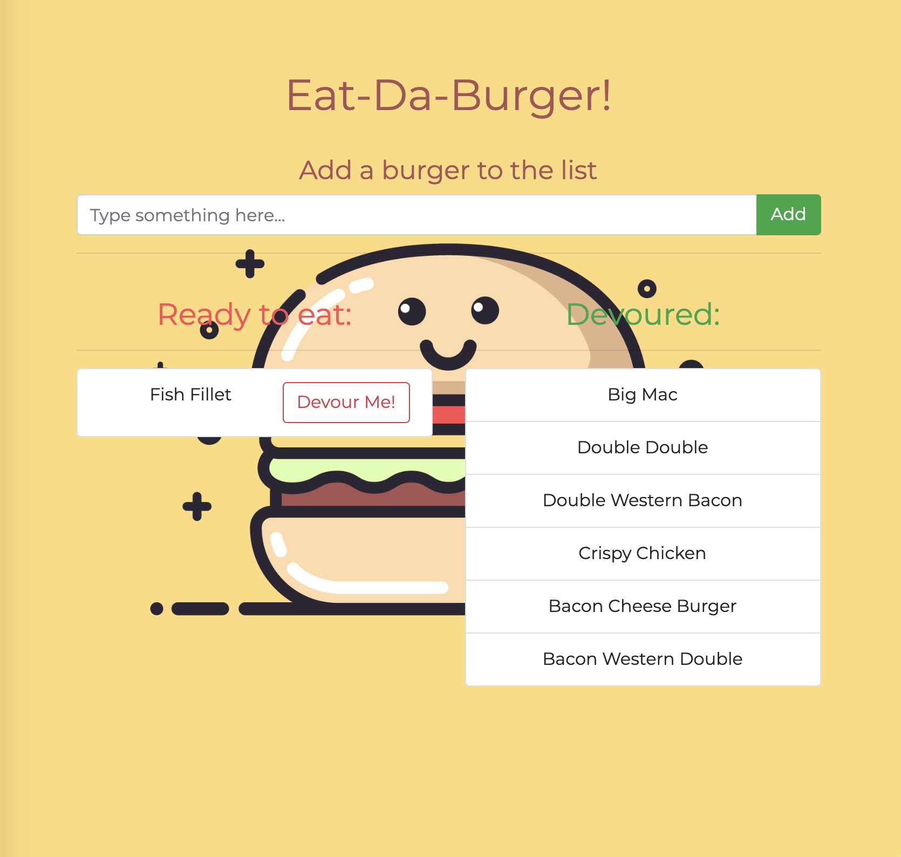

# Eat-Da-Burger! (Express, Node, MySQL, Handlebars, ORM)

Add a burger to a ready to eat list. Click on the devour button to move the burger to the devoured list.
Deployed to heroku: https://salty-springs-75637.herokuapp.com/

## Setup & Requirements
- `git clone <repo>`.
- `npm install`.
- Create mock database using schemas in `/db/<filename>.sql`.
- Configure MySQL connection in `/config/connection.js`.
- Connection sample:

```javascript
var mysql = require('mysql');
...

 // create connection to mysql
 var connection = mysql.createConnection({
    host: 'localhost',
    port: 8889,
    user: 'root',
    password: 'root',
    database: 'burgers_db'
});
```

## Application
- Start the server: `node server.js`.




## Technologies:
- Express.js
- Node.js
- MySQL
- Handlebars
- ORM
